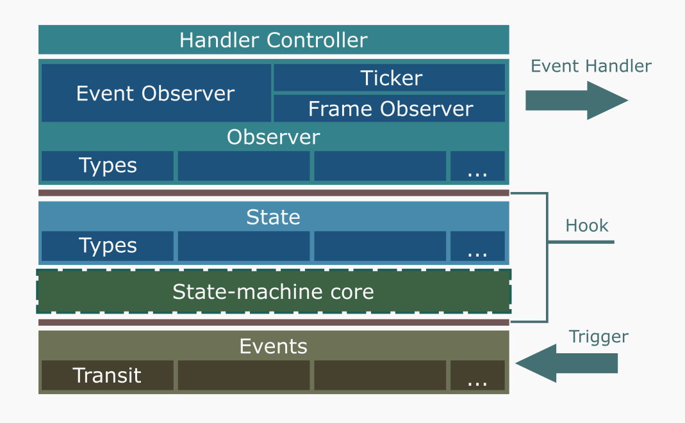

## Introduction

Genesm is finite state machine (FSM) implementation.

Which provide generic style API to manage multiple type of state without type
assertion. make your program coding safety and run quickly.

Genesm provided a asynchronous event framework. It native have thread-safe
protect, handle timeout warning and blocking limitation. you can safely
in-order to manage state and handle event in a asynchronous program.

API document and example please see:
https://pkg.go.dev/github.com/fiathux/genesm

## How it work

See the framework below:

- __Handler Controller__: scheduler of event handler which handle event in a queue,
check timeout and protect followed procedures
- __Observer__: to handle event for different type of state. genesm provide two
style of observer:
    - Event observer: for event-based handler to handle each type of event
    - Frame observer: for time-based handler will storage state and
periodically sampling it
- __State__: any type of user data which could be managed by state machine
- __State-machine Core__: some abstrict management components to implemented
state regist, keep and change
- __Events__: to make association between two state. when event be triggering,
will check whether current state is correct and try change to next state.
